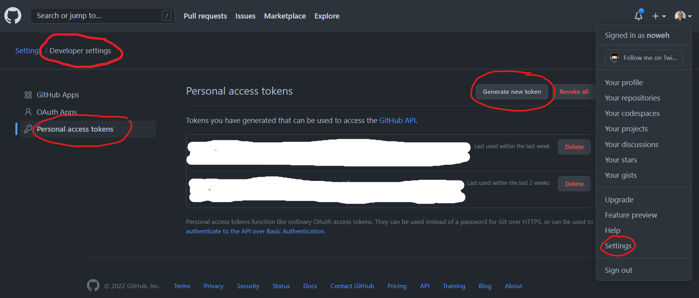
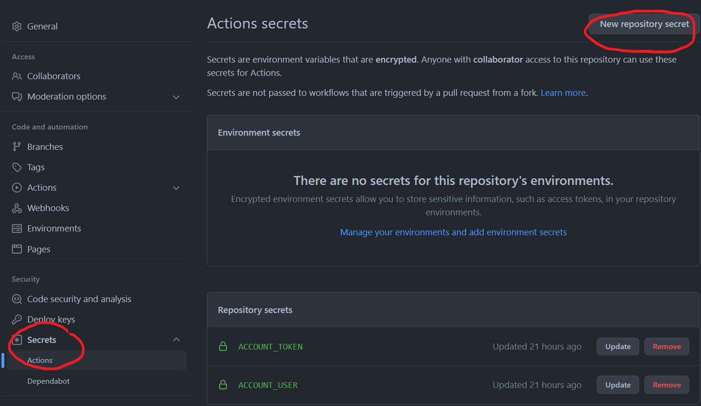

# Test Github APIs

## How to use

### Step 1: Create a Personal access token

In Settings / Developer settings / personal access tokens.

=> Generate new token

### Step 2: create .env file and copy/paste the token and username in this file and in Github repository secrets

In Settings / Secrets / Actions.

=> New repository secret